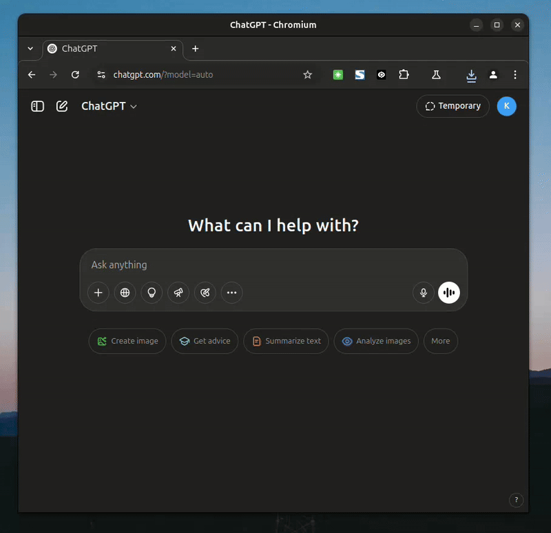

# Chrome Interaction Collector Extension

<div align="center">
  
</div>

A Chrome extension that collects and monitors user interactions on webpages, including mouse movements, scrolls, clicks, and keypresses.

## Features

- **Real-time Interaction Tracking**
  - Mouse movements
  - Scroll actions
  - Click events
  - Keypress events
  - Session-based tracking

- **Interactive Dashboard**
  - Real-time statistics display
  - Total metrics tracking
  - Download history with timestamps
  - Start/Stop collection toggle
  - Configurable interaction limit

- **Data Management**
  - Automatic downloads when interaction limit is reached
  - Session-based data organization
  - JSON format output
  - Download history tracking

## Installation

1. Clone this repository
2. Open Chrome and navigate to `chrome://extensions/`
3. Enable "Developer mode" in the top right
4. Click "Load unpacked" and select the extension directory

## Usage

1. Click the extension icon to open the popup interface
2. Use the toggle button to start/stop collecting interactions
3. Monitor real-time statistics in the popup
4. Set your preferred interaction limit (default: 1000)
5. View download history of collected data

## Output Format

The extension generates JSON files with the following structure:

```json
{
  "277445692": {
    "ct8swwwc9": [
      {
        "action": "mouse_move",
        "timestamp": 1746308491878,
        "x": 1053,
        "y": 371
      },
      {
        "action": "scroll",
        "timestamp": 1746308517804,
        "current_offset": 7,
        "total_offset": 4217,
        "scroll_direction": "down"
      },
      {
        "action": "scroll",
        "timestamp": 1746308517815,
        "current_offset": 16,
        "total_offset": 4217,
        "scroll_direction": "down"
      },
      {
        "action": "click",
        "x": 1078,
        "y": 331,
        "timestamp": 1746308492616,
        "target": {
          "tag": "DIV",
          "type": "",
          "width": 1069,
          "height": 40,
          "position": [
            802,
            312.5
          ]
        }
      },
      {
        "action": "keypress",
        "timestamp": 1746308678614
      },
      {
        "action": "keypress",
        "timestamp": 1746308678677
      },
    ]
  }
}
```

### Interaction Types

1. **Mouse Movement**
   - Tracks cursor position (x, y coordinates)
   - Includes timestamp of the movement

2. **Scroll**
   - Records scroll direction and distance
   - Tracks both horizontal and vertical scrolling

3. **Click**
   - Captures click position
   - Element clicked: element type button/link/input ..
   - Includes click timestamp

4. **Keypress**
   - Does not records the pressed key
   - Includes timestamp of the keypress

## Configuration

- **Interaction Limit**: Set the number of interactions before automatic download (default: 1000)
- **Collection Toggle**: Start/stop data collection at any time
- **Session Management**: Each browser tab maintains its own session ID

## Privacy

- All data is stored locally
- No data is sent to external servers
- Data is only downloaded when explicitly requested or when the interaction limit is reached

## Development

The extension consists of the following components:
- `manifest.json`: Extension configuration
- `popup.html/js`: User interface and controls
- `content.js`: Interaction tracking logic
- `background.js`: Data management and download handling

## License

MIT License 